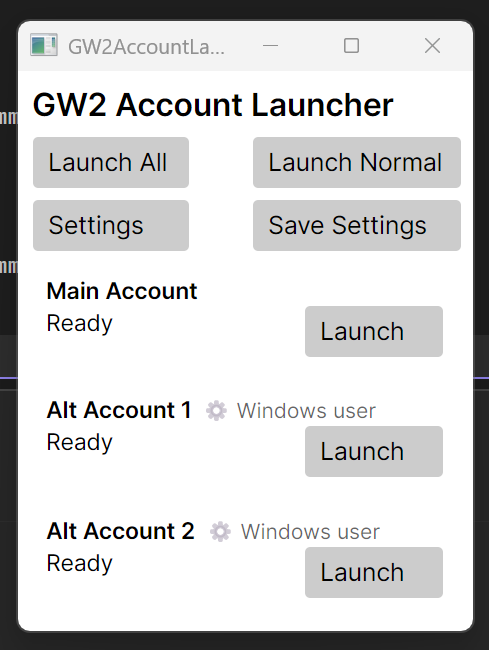
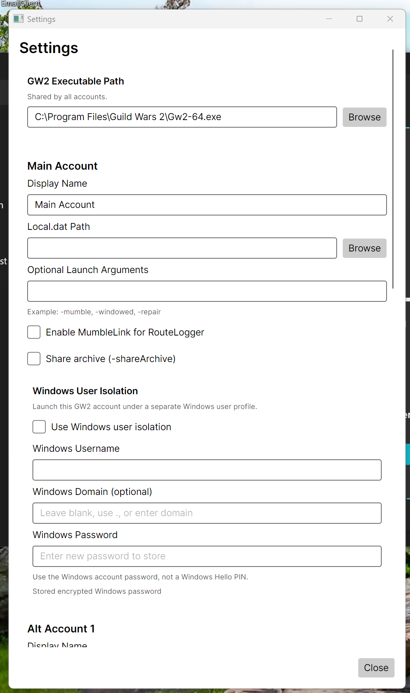

# What a GW2 Multi-Account Launcher Taught Me (So You Don’t Spend 23 Hours on the Wrong Problem)

This repository contains a lessons-learned writeup about building a personal Guild Wars 2 multi-account launcher. It is a documentation-focused repo, not a public release of the launcher source code.

## Author’s Note: AI as Partner, Not Replacement

This document was written with the help of an AI assistant, but it is based entirely on real experience: a long, frustrating day of trial and error, followed by a design pivot that finally made sense.

The intent is not to let AI invent a story that never happened, but to use it as a tool to express a real one more clearly. The ideas, missteps, and lessons are human; the AI simply helped organize and phrase them.

That is the role AI is meant to play here:

- Assist with wording and structure, not fabricate experience.
- Handle the tedious parts, so more attention can stay on design and ethics.
- Act as a partner in thinking, not a replacement for doing the thinking.

Readers are encouraged to treat AI the same way in their own projects: live the problems yourself, form your own judgment, and then let the tools help you turn that experience into code, documentation, or stories that others can benefit from.

## Intro

This writeup comes from a retired engineer and self-taught application builder who still spends a lot of time creating quality-of-life tools for personal use. Over the years, that work has ranged from utility software and media-management tools to Guild Wars 2 helpers, and the common thread has always been the same: identify friction, then build something that makes daily use smoother.

The project described here was not originally intended for public release. It started as a personal Guild Wars 2 quality-of-life tool after an older multi-account launcher stopped working, and the need for a replacement became impossible to ignore. What makes the story useful is not just the final result, but the path through the wrong assumptions, the long detour, and the eventual design decision that made the whole thing fall into place.

## Context: A QoL Tool That Became Necessary

For years, an existing third-party GW2 launcher handled the multi-account workflow well enough that there was no real reason to build a replacement. Only when it stopped working did the value of that convenience become obvious.

Suddenly the workflow was back to manual account juggling, and the pain was noticeable enough to justify building a personal `GW2AccountLauncher`. The initial idea seemed simple: provide an easier way to move among multiple Guild Wars 2 accounts without manually wrestling with configuration every time.

What followed turned into a strong reminder that some of the worst development days happen when a simple idea is built on a bad assumption.

## The Initial Assumption

Because the older launcher had worked for years, it was easy to assume its underlying approach must have been the correct one. That assumption quietly shaped the whole design process.

In practice, that meant treating `local.dat` as something that needed to be manually managed, swapped, or orchestrated from the outside. Instead of questioning whether that was the right level at which to solve the problem, the effort focused on reproducing and improving a model that was already taken for granted.

That is where the trouble started. A solution that has “worked” for years is not automatically the right solution. Sometimes it is simply an older workaround that survived because no one stopped to challenge it.

## The 23-Hour Rabbit Hole

Once the design was built around manually handling `local.dat`, the project became a long chain of edge cases, failed attempts, and increasingly brittle logic. Each improvement seemed to create another special case to account for.

The problem was not a lack of effort. The real problem was that the effort was being spent in the wrong place. Instead of asking whether the operating system already had a cleaner way to separate account-specific state, the work kept going deeper into custom juggling of files and launch behavior.

That led to one of those days where a project feels like it belongs in the trash bin more than in the finished-app folder. It became a 23-plus-hour nightmare not because the goal was unreasonable, but because the framing of the problem was off.

## The Pivot That Changed Everything

The breakthrough came from finally stepping back and asking a different question: why manually manage `local.dat` at all if Windows already knows how to isolate per-user data?

That shift in thinking changed the whole direction of the project. Instead of trying to outsmart the game’s local configuration handling, the design moved to letting separate Windows users own their own Guild Wars 2 environment and local state.

Once that happened, the process fell into place:

- Each GW2 account could live under its own Windows user context.
- Windows could create and manage the relevant local data naturally.
- The launcher no longer needed to own fragile file-swapping behavior.
- The job of the launcher became much simpler: pick the right context and start the game.

The final approach was cleaner because it stopped fighting the platform. Rather than simulating separation through custom logic, it used the separation Windows was already built to provide.

## The Ethical Stopping Point

After reaching a working launcher, there was still room to push the automation further. It would have been possible to try to automate more of the login flow itself.

That is where an intentional boundary mattered. Clicking a couple of buttons like **Login** and **Play** was a very small price to pay for a clean and respectful result. Trying to bypass subtle ArenaNet prompts such as 2FA sign-up reminders or “Remind me later” dialogs felt like crossing from quality-of-life automation into something less defensible.

Stopping at that point produced a better tool for two reasons:

- It respected the game’s intended security and account flow.
- It avoided fragile hacks that would likely break or become questionable later.

Not every point of friction should be automated away. Sometimes the right design choice is knowing exactly where automation should stop.

## Lessons for Junior Engineers

Several lessons from this project are worth passing on, especially to junior or self-taught developers.

1. **A tool that works is not automatically designed well.** Longevity can hide bad assumptions.
2. **When a problem becomes increasingly brittle, question the framing before writing more code.** Complexity is often a clue that the solution is happening at the wrong layer.
3. **Let the operating system or platform handle what it already knows how to do well.** Replacing built-in separation with custom logic usually creates unnecessary pain.
4. **There is value in deciding not to automate everything.** Security prompts, consent points, and account-protection steps deserve caution.
5. **A personal quality-of-life tool can still teach public lessons.** Even if the code stays private, the reasoning can help others avoid the same trap.

## Why Share the Lesson Instead of the Tool

This launcher began as a personal quality-of-life project, not a public product meant for general release or long-term support. That makes it reasonable to hesitate before pushing the code to GitHub for public consumption.

At the same time, the story behind the project has value on its own. The real takeaway is not just that a launcher was built, but that a frustrating and nearly abandoned project finally worked once the problem was reframed correctly and the platform was allowed to do more of the heavy lifting.

That is the part most worth sharing. The code may remain private, but the lesson is portable.

## Screenshots

Main launcher window:

Settings window:

